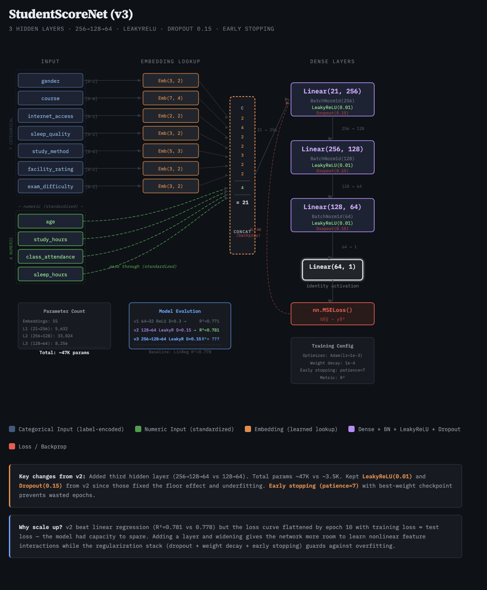

# Student Test Score Prediction

MSE 546 Final Project — Group 3

Cecilia Su, Jeevan Parmar, Levenet Eren, Joseph Ngai, Patrick Bennett

Regression model to predict student exam scores based on academic behavior, study habits, lifestyle routines, and exam conditions. Built for the Kaggle [Playground Series S6E1](https://www.kaggle.com/competitions/playground-series-s6e1) competition.

## Dataset

The dataset contains 20,000 rows with the following features:

| Feature | Type |
|---|---|
| `age` | Quantitative |
| `gender` | Categorical |
| `course` | Categorical |
| `study_hours` | Quantitative |
| `class_attendance` | Quantitative |
| `internet_access` | Binary |
| `sleep_hours` | Quantitative |
| `sleep_quality` | Categorical |
| `study_method` | Categorical |
| `facility_rating` | Categorical |
| `exam_difficulty` | Categorical |
| **`exam_score`** | **Target** |

## Project Structure

```
Student-Test-Score-Prediction/
├── data/                  # CSV files (gitignored, download from Kaggle)
│   ├── train.csv
│   ├── test.csv
│   └── sample_submission.csv
├── notebooks/
│   ├── initial_linear_regression.ipynb  # Baseline linear regression + EDA
│   ├── genetic_algorithm.ipynb          # GA feature selection on linear regression
│   ├── random_forest.ipynb              # Random forest regressor
│   ├── xgboost_baseline.ipynb           # XGBoost baseline model
│   ├── xgboost_improved.ipynb           # XGBoost with tuned hyperparameters
│   └── neural_network_linear_embedded.ipynb  # Neural network linear embedded model
├── models/                # Saved model files (.pkl, gitignored)
├── metrics/               # Saved metrics CSVs (gitignored)
├── submission/            # Generated submission CSVs (gitignored)
├── .env.example           # Template for API credentials
├── .gitignore
├── requirements.txt
└── README.md
```

## Setup

### 1. Clone the repo

```bash
git clone https://github.com/<your-username>/Student-Test-Score-Prediction.git
cd Student-Test-Score-Prediction
```

### 2. Create and activate a virtual environment

```bash
python3 -m venv venv
source venv/bin/activate
```

### 3. Install dependencies

```bash
pip install -r requirements.txt
```

### 4. Set up Kaggle API credentials

1. Go to [kaggle.com/settings](https://www.kaggle.com/settings) and click **"Create New Token"**
2. Copy the token
3. Create a `.env` file from the example:

```bash
cp .env.example .env
```

4. Open `.env` and paste your token

### 5. Download the data

```bash
source .env
kaggle competitions download -c playground-series-s6e1
unzip playground-series-s6e1.zip -d data/
rm playground-series-s6e1.zip
```

Or download the files manually from [Kaggle](https://www.kaggle.com/competitions/playground-series-s6e1/data) and place them in `data/`.

## Updating Dependencies

After installing a new package, update `requirements.txt`:

```bash
pip freeze > requirements.txt
```

## Submission

Make sure your Kaggle API credentials are loaded, then submit:

```bash
source .env
kaggle competitions submit \
  -c playground-series-s6e1 \
  -f "submission/neural_network_linear_embedded_submission.csv" \
  -m "Message"
```

Replace the file path with your submission file and `"Message"` with a description of your submission (e.g., model type, changes made).

To check your submission results:

```bash
kaggle competitions submissions -c playground-series-s6e1
```

Or view them on the [competition leaderboard](https://www.kaggle.com/competitions/playground-series-s6e1/leaderboard).

## Architecture

### Neural Network Linear Embedded



## Results

### Local Evaluation (Validation Set)

| Model | MAE | RMSE | R² |
|---|---|---|---|
| XGBoost Improved | 6.9674 | 8.7423 | 0.7851 |
| Neural Network Linear Embedded | 7.0562 | 8.8355 | 0.7815 |
| Linear Regression | 7.0933 | 8.8865 | 0.7780 |
| Genetic Algorithm | 7.0933 | 8.8865 | 0.7780 |
| XGBoost Baseline | 7.0829 | 8.9026 | 0.7771 |
| Random Forest | 7.2497 | 9.1079 | 0.7668 |

### Kaggle Leaderboard (RMSE)

| Model | Private Score | Public Score |
|---|---|---|
| XGBoost Improved | 8.75240 | 8.72307 |
| Neural Network Linear Embedded | 8.86626 | 8.84533 |
| Linear Regression | 8.89132 | 8.87232 |
| Genetic Algorithm | 8.89132 | 8.87232 |
| XGBoost Baseline | 8.90292 | 8.86689 |
| Random Forest | 9.10425 | 9.07951 |

Lower RMSE is better. The **XGBoost Improved** achieved the best performance across all metrics.
